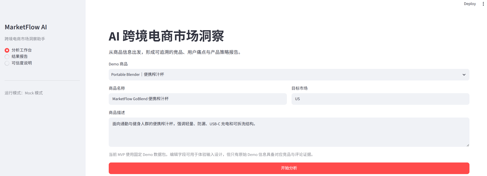
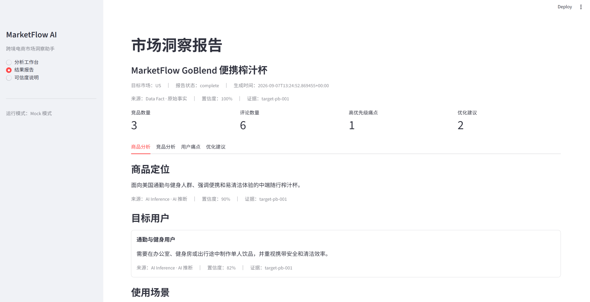
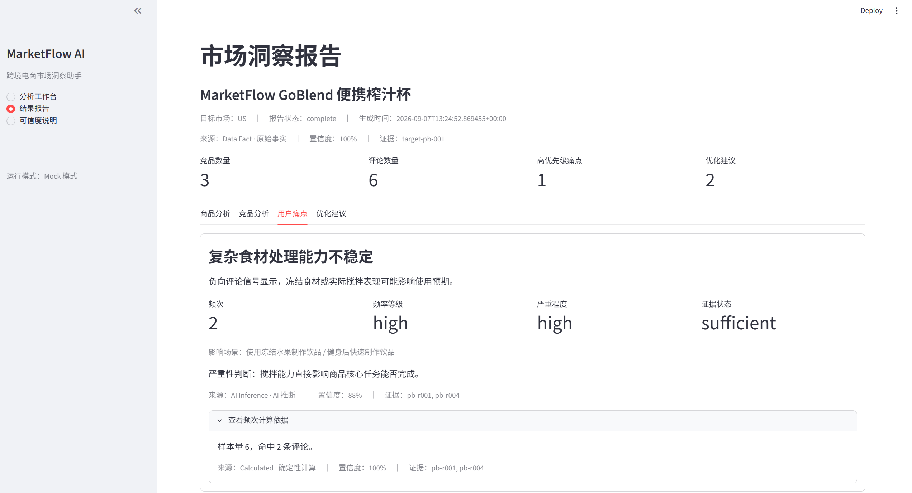
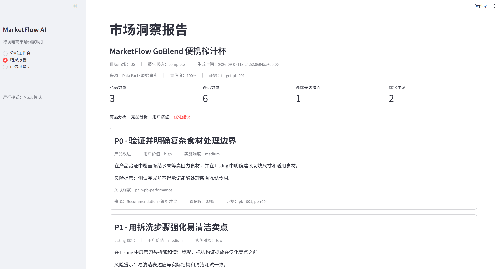
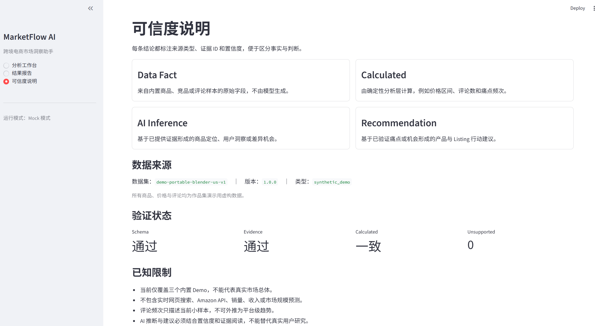

# MarketFlow AI｜跨境电商市场洞察助手

> 基于可追溯样例数据，将商品、竞品和用户评论转化为可信、可执行的商品决策建议。

MarketFlow AI 是一个面向 AI 产品、AI 产品运营和跨境电商 AI 岗位的作品集项目。它关注的不是“让模型写一份长报告”，而是如何把分散信息转化为有依据、可校验、能支持商品讨论的结构化洞察。

| 公开 Demo 状态 | 结果 |
| --- | ---: |
| Demo 商品 | 3 个 |
| 端到端验收 | 3/3 通过 |
| Pipeline 成功率 | 100% |
| Schema / Evidence / Consistency Validation | 全部通过 |
| `unsupported_claim_count` | 0 |



## 业务问题

在新品规划和商品优化阶段，跨境卖家通常需要同时处理商品资料、竞品参数和用户评论。人工分析存在三个典型问题：

- 信息分散：价格、功能、卖点和评论问题难以形成统一视图。
- 结论缺少依据：很难快速判断一句洞察来自原始数据还是主观判断。
- 建议难以落地：用户问题、竞品机会与产品行动之间缺少明确关联和优先级。

MarketFlow AI 将这些信息放入同一条决策链路，让用户既能看到结论，也能理解结论从哪里来、是否通过验证。

## 产品流程

```text
商品输入
  → 确定性分析
  → LLM 洞察
  → Validation
  → 结构化报告
```

设计原则是：能稳定计算的字段不交给 LLM；需要语义理解的任务才使用 LLM；任何生成结果在验证通过前都不能进入最终报告。

## 核心能力



### 商品定位

基于商品描述整理目标用户、使用场景、核心卖点和信息缺口，帮助判断商品表达是否清晰。

### 竞品分析

展示确定性价格区间和竞品矩阵，并基于已有样例识别优势、不足和差异机会。

### 用户痛点

从评论样例中形成痛点候选，展示频次、严重程度、证据状态和评论 Evidence ID。



### 产品优化建议

将已验证的痛点与差异机会转化为产品改进、Listing 优化和定位建议，并标注优先级、实施难度和风险提示。



## AI 产品设计亮点

### 1. 四层来源区分

| 标签 | 含义 | 典型内容 |
| --- | --- | --- |
| Data Fact | 直接来自样例数据 | 商品描述、竞品参数、评论 ID |
| Calculated | 程序确定性计算 | 价格区间、评论数量、痛点频次 |
| AI Inference | LLM 基于证据形成的判断 | 商品定位、痛点总结、差异机会 |
| Recommendation | 基于已验证洞察形成的行动建议 | 产品、Listing 与定位优化 |

这套区分避免用户把 AI 判断误认为市场事实。



### 2. 确定性计算与 LLM 分工

价格、评论数量、平均评分和频次由 analysis 层计算。LLM 不拥有这些数字的计算权，只负责需要语义理解的洞察，并在输出后接受一致性检查。

### 3. Evidence ID 可追溯

每条关键结论都包含 `evidence_ids`、`confidence` 和 `source_type`。痛点必须引用当前数据集存在的评论；建议必须关联有效痛点或竞品机会。

### 4. JSON Schema 约束

商品分析、竞品分析、痛点、建议和最终报告都有独立 JSON Schema，使输出可以被程序校验并被前端稳定消费。

### 5. 三层 Validation

- Schema Validator：检查必填字段、类型和枚举。
- Evidence Validator：检查 Evidence ID、痛点证据和建议关联。
- Consistency Checker：检查价格、评论数量、频次和竞品矩阵是否被改写。

任一关键检查失败，Pipeline 不生成或覆盖最终报告。

### 6. 数据不足时不强行生成

Prompt 禁止编造竞品、评论和数字。证据不足时返回 `insufficient_evidence`，或降低证据状态与置信度，而不是依赖模型记忆补全市场事实。

## Demo

### Portable Blender

用于验证复杂食材处理表现、清洗负担与便携体验相关洞察。

### Pet Water Fountain

用于验证清洁维护、滤芯成本和噪音相关洞察。

### Ergonomic Seat Cushion

用于验证长期支撑稳定性、尺寸适配和舒适度相关洞察。

三个案例中的商品、品牌、价格和评论均为 Synthetic Demo Data。

## 最终验收

三个 Demo 全部完成以下链路：

```text
输入
  → analysis
  → Mock LLM
  → validation
  → final_report
  → 页面展示
  → 可信度页面
```

端到端通过率：**3/3（100%）**。

当前公开 Demo 默认使用 `MOCK_MODE=true`，目的是提供稳定、可复现的作品集演示。项目已经预留 OpenAI-compatible LLM Client，但**真实模型效果不计入当前验收成绩**，仍需使用独立数据集和人工评分进行评测。

## 本地运行

建议使用 Python 3.11 或 3.12。

```powershell
python -m pip install streamlit
$env:MOCK_MODE = "true"
streamlit run app/main.py
```

页面启动后：

1. 在“分析工作台”选择一个 Demo。
2. 点击“开始分析”。
3. 打开“结果报告”查看商品、竞品、痛点和建议。
4. 打开“可信度说明”查看来源标签与 Validation 结果。

## 当前限制

- 使用 Demo / Synthetic 数据，不能代表真实市场总体。
- 不使用实时 Amazon 数据。
- 不进行销量、市场规模或收入预测。
- 评论频次只描述当前小样本，不可外推为平台趋势。
- 真实 LLM 质量仍需单独评测，不属于当前 100% 验收结果。

## 目录导航

```text
app/            Streamlit 产品展示
analysis/       确定性数据分析
validation/     结构、证据与一致性验证
schemas/        JSON 输出契约
llm/            Prompt Package 与洞察任务边界
llm_client/     模型调用兼容层
pipeline/       端到端编排与 Mock 输出
data/           三个 Synthetic Demo 数据集
docs/           产品、架构、治理、评测与面试材料
assets/         待补充的真实截图清单
```

## 深入阅读

- [项目概览](docs/01-project-overview.md)
- [系统架构](docs/02-architecture.md)
- [AI 治理与幻觉控制](docs/03-ai-governance.md)
- [评测与验收](docs/04-evaluation.md)
- [面试介绍](docs/05-interview-guide.md)
- [截图准备清单](assets/README.md)

## 免责声明

本项目仅用于作品集展示。所有商品、竞品、价格和评论均为模拟数据，不代表任何真实平台、品牌或市场状态。
