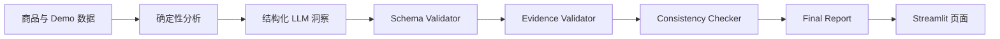

# 02｜系统架构

## 架构目标

系统架构围绕三个产品目标设计：稳定演示、结论可追溯、错误不可直接进入报告。

## 输入与数据层

每个 Demo 包含：

- `product.json`：商品名称、目标市场、描述和声明卖点；
- `competitors.json`：竞品价格、评分、功能和卖点；
- `reviews.csv`：带唯一 ID 的评论样例。

数据集带版本、来源类型和免责声明，便于复现与审计。

## 确定性分析层

该层负责所有可稳定计算的内容：

- 最低价、最高价、均值、中位数和价格区间；
- 评论数量、平均评分和评分分布；
- 高频关键词和基础痛点信号；
- 竞品数量、功能差异和价格梯度。

这些字段属于 `Calculated`，后续生成环节只能复制，不能改写。

## LLM 洞察层

该层接收确定性分析结果和允许使用的 Evidence ID，负责：

- 商品定位、目标用户、场景和卖点总结；
- 竞品优势、不足、差异机会与痛点解释；
- 产品改进、Listing 优化和定位建议。

每个阶段都使用固定 Prompt Package 和目标 Schema，不直接消费未经选择的外部信息。

## Validation 层

Validation 独立于 Prompt：

1. Schema Validator 检查输出结构。
2. Evidence Validator 检查证据存在性和关联关系。
3. Consistency Checker 对比不可变数字与竞品矩阵。
4. 完整报告再通过 Final Report Schema。

系统采用 fail-closed 策略：关键验证失败时停止，不创建新的最终报告。

## 展示层

Streamlit 提供分析工作台、结果报告和可信度说明三个页面。页面优先读取已经验证的 `final_report.json`，并在报告中显示来源类型、Evidence ID 和置信度。

## 运行模式

公开 Demo 默认使用 Mock 输出，确保演示结果可重复。模型调用兼容层与 Pipeline 解耦，因此替换模型不需要改变数据分析、Schema 或 Validation 规则。
